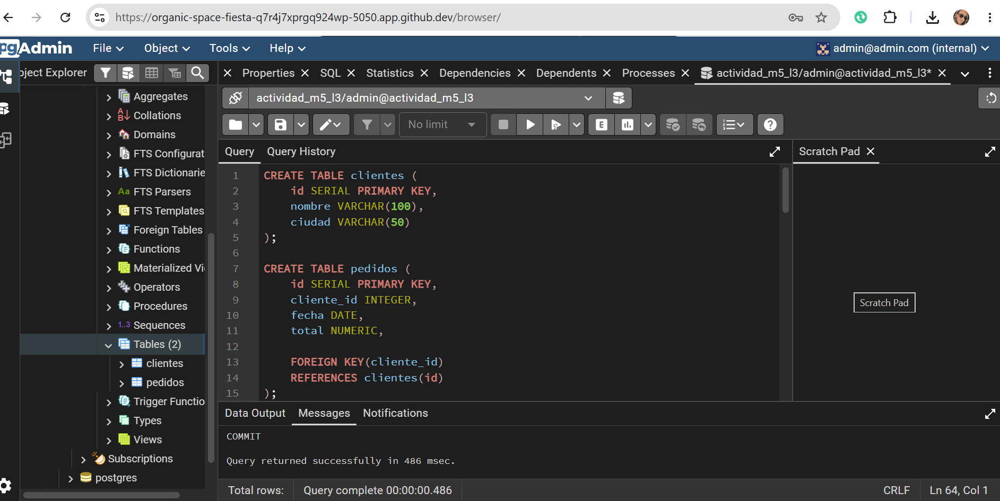

# Actividad M5 L3 - Manipulación de Datos y Transacciones

Este proyecto corresponde a la actividad M5 L3 del módulo de Bases de Datos Relacionales.

El objetivo de esta actividad es trabajar con manipulación de datos utilizando sentencias SQL como:

- INSERT
- UPDATE
- DELETE
- Transacciones
- COMMIT
- ROLLBACK

La actividad fue desarrollada utilizando PostgreSQL y Docker Compose, trabajando sobre las tablas `clientes` y `pedidos` creadas en la actividad anterior.

---

# Estructura de la Base de Datos

## Tabla clientes

```sql
CREATE TABLE clientes (
    id SERIAL PRIMARY KEY,
    nombre VARCHAR(100),
    ciudad VARCHAR(50)
);
```

---

## Tabla pedidos

```sql
CREATE TABLE pedidos (
    id SERIAL PRIMARY KEY,
    cliente_id INTEGER,
    fecha DATE,
    total NUMERIC,

    FOREIGN KEY(cliente_id)
    REFERENCES clientes(id)
);
```

---

# Datos Iniciales

## Registros de clientes

```sql
INSERT INTO clientes (nombre, ciudad) VALUES
('Camila', 'Santiago'),
('Javier', 'Valparaíso'),
('Fernanda', 'Santiago'),
('Martín', 'Arica'),
('Paula', 'Valparaíso');
```

---

## Registros de pedidos

```sql
INSERT INTO pedidos (cliente_id, fecha, total) VALUES
(1, '2026-05-01', 50000),
(1, '2026-05-03', 70000),
(2, '2026-05-05', 30000),
(3, '2026-05-08', 120000),
(5, '2026-05-10', 25000);
```

---

# Contenido del Proyecto

- `manipulacion_datos.sql`
- `transacciones.md`
- `README.md`

---

# Tecnologías Utilizadas

- PostgreSQL
- Docker
- Docker Compose
- SQL
- GitHub

---

# Captura de Resultados

